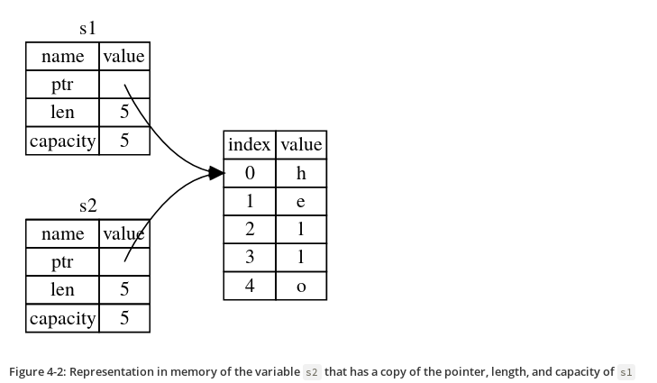

<!-- markdown-toc start - Don't edit this section. Run M-x markdown-toc-refresh-toc -->
**Table of Contents**

- [Introduction](#introduction)
- [Chapter 1 - Getting started](#chapter-1---getting-started)
- [Chapter 2 - Programming a Guessing game](#chapter-2---programming-a-guessing-game)
- [Chapter 3 - Common Programming Concepts](#chapter-3---common-programming-concepts)
    - [Constants](#constants)
    - [Shadowing](#shadowing)
    - [Data types](#data-types)
        - [Scalar types](#scalar-types)
        - [Compound types](#compound-types)
    - [Functions](#functions)
    - [Control Flow](#control-flow)
        - [If Expressions](#if-expressions)
        - [loop construct](#loop-construct)
        - [while loop](#while-loop)
        - [for loop](#for-loop)
- [Chapter 4 - Understanding Ownership](#chapter-4---understanding-ownership)
    - [Heap vs Stack](#heap-vs-stack)
    - [Ownership rules](#ownership-rules)
    - [The String type](#the-string-type)
    - [Ways Variable and Data interact](#ways-variable-and-data-interact)
    - [Ownership and functions](#ownership-and-functions)
    - [References and Borrowing](#references-and-borrowing)
    - [Mutuable references](#mutuable-references)
    - [The Slice type](#the-slice-type)
        - [String Slices](#string-slices)
        - [Other Slices](#other-slices)
- [Chapter 5 - Using Structs](#chapter-5---using-structs)
    - [Some syntax sugars](#some-syntax-sugars)
    - [Tuple Structs](#tuple-structs)
    - [Method Syntax](#method-syntax)
    - [Associated functions](#associated-functions)
- [Chapter 6 - Enums and Pattern matching](#chapter-6---enums-and-pattern-matching)
    - [Option type](#option-type)
    - [`match` Control Flow Operator](#match-control-flow-operator)
    - [Matching with Option<T>](#matching-with-optiont)
    - [if let](#if-let)
- [Chapter 7 - Managing Growing Projects with Packages, Crates, and Modules](#chapter-7---managing-growing-projects-with-packages-crates-and-modules)
    - [Packages and Crates](#packages-and-crates)
    - [Defining Modules to Control Scope and Privacy](#defining-modules-to-control-scope-and-privacy)
    - [Paths for Referring to an Item in the Module Tree](#paths-for-referring-to-an-item-in-the-module-tree)
    - [super keyword](#super-keyword)
    - [Making Structs and Enums Public](#making-structs-and-enums-public)
    - [Bringing Paths into Scope with the use keyword](#bringing-paths-into-scope-with-the-use-keyword)
    - [Providing New Names with the as Keyword](#providing-new-names-with-the-as-keyword)
    - [Re-exporting Names with pub use](#re-exporting-names-with-pub-use)
    - [Using External packages](#using-external-packages)
    - [Using Nested Paths to Clean Up Large use Lists](#using-nested-paths-to-clean-up-large-use-lists)
    - [The Glob Operator](#the-glob-operator)
    - [Separating modules into Different files](#separating-modules-into-different-files)
- [Chapter 8 - Common Collections](#chapter-8---common-collections)
    - [Vectors](#vectors)
    - [Strings](#strings)
    - [HashMap](#hashmap)
        - [Hashmap and ownership](#hashmap-and-ownership)
- [Chapter 9 - Error Handling](#chapter-9---error-handling)
    - [panic! macro](#panic-macro)
    - [Recoverable errors with Result](#recoverable-errors-with-result)
    - [Shortcuts for Panic on Error: unwrap and expect](#shortcuts-for-panic-on-error-unwrap-and-expect)
    - [Propagating errors](#propagating-errors)
- [Chapter 10 - Generic Types, Traits and Lifetimes](#chapter-10---generic-types-traits-and-lifetimes)
    - [Generic Structs](#generic-structs)
    - [Enum Structs](#enum-structs)
    - [Generics in method definitions](#generics-in-method-definitions)
        - [Traits: Defining shared behaviour](#traits-defining-shared-behaviour)
    - [Default implementations](#default-implementations)
    - [Traits as Parameters](#traits-as-parameters)
    - [Trait Bound syntax](#trait-bound-syntax)
    - [Specifying Multiple Trait Bounds with the + Syntax](#specifying-multiple-trait-bounds-with-the--syntax)
    - [Clearer Trait Bounds with where Clauses](#clearer-trait-bounds-with-where-clauses)
    - [Returning Types that Implement Traits](#returning-types-that-implement-traits)
        - [Validating references with Lifetimes](#validating-references-with-lifetimes)
    - [The Borrow Checker](#the-borrow-checker)
    - [Generic Lifetimes in Functions](#generic-lifetimes-in-functions)
    - [Lifetime Annotation Syntax](#lifetime-annotation-syntax)
    - [Lifetime Annotations in Function Signatures](#lifetime-annotations-in-function-signatures)
    - [Lifetime Annotations in Struct Definitions](#lifetime-annotations-in-struct-definitions)
    - [Lifetime Elision](#lifetime-elision)
    - [Lifetime Annotations in Method Definitions](#lifetime-annotations-in-method-definitions)
    - [The Static Lifetime](#the-static-lifetime)
- [Chapter 11 - Writing Automated Tests](#chapter-11---writing-automated-tests)
    - [Checking for Panics with should_panic](#checking-for-panics-with-should_panic)
    - [Using Result<T, E> in Tests](#using-resultt-e-in-tests)
    - [Controlling How Tests Are Run](#controlling-how-tests-are-run)
    - [Various test options](#various-test-options)
    - [Test Organization](#test-organization)
        - [Unit tests](#unit-tests)
        - [Integration Tests](#integration-tests)
- [Chapter 12](#chapter-12)
- [Chapter 13 - Functional Language Features: Iterators and Closures](#chapter-13---functional-language-features-iterators-and-closures)
    - [Motivation for Closure](#motivation-for-closure)
    - [Closure Type Inference and Annotation](#closure-type-inference-and-annotation)
    - [Storing Closures Using Generic Parameters and the `Fn` Traits](#storing-closures-using-generic-parameters-and-the-fn-traits)
    - [Capturing the Environment with Closures](#capturing-the-environment-with-closures)
    - [Iterators](#iterators)
    - [Other Examples](#other-examples)
- [Chapter 14 - More about Cargo and Crates.io](#chapter-14---more-about-cargo-and-cratesio)
    - [Customizing Builds with Release Profiles](#customizing-builds-with-release-profiles)
    - [Documentation comment](#documentation-comment)
    - [Publishing package](#publishing-package)
    - [Yank](#yank)
    - [Cargo Workspaces](#cargo-workspaces)
    - [cargo install](#cargo-install)
    - [Custom cargo commands](#custom-cargo-commands)
- [Chapter 15 - Smart Pointers](#chapter-15---smart-pointers)
    - [Box<T>](#boxt)
    - [Enabling recursive types with Boxes](#enabling-recursive-types-with-boxes)
    - [Deref Trait](#deref-trait)
    - [Implicit Deref Coercions with Functions and Methods](#implicit-deref-coercions-with-functions-and-methods)
    - [Deref Coercion and Mutability](#deref-coercion-and-mutability)
    - [Drop trait](#drop-trait)
    - [Rc<T>, the Reference counted Smart Pointer](#rct-the-reference-counted-smart-pointer)
    - [RefCell<T> and Interior mutability](#refcellt-and-interior-mutability)
    - [Combining Rc<T> and RefCell<T>](#combining-rct-and-refcellt)
    - [Reference cycle example](#reference-cycle-example)
    - [Weak](#weak)
- [Chapter 16 - Fearless Concurrency](#chapter-16---fearless-concurrency)
    - [Thread Primitives](#thread-primitives)
    - [Message passing between Threads](#message-passing-between-threads)
    - [Shared state Concurrency](#shared-state-concurrency)
    - [Sync and Send Traits](#sync-and-send-traits)
- [Chapter 17 - OOP Features of Rust](#chapter-17---oop-features-of-rust)
    - [Using Trait Objects That Allow for Values of Different Types](#using-trait-objects-that-allow-for-values-of-different-types)
    - [Object safety is required for Trait Object](#object-safety-is-required-for-trait-object)
    - [Implementing an OODP](#implementing-an-oodp)
    - [Chapter 18: Patterns and matching](#chapter-18-patterns-and-matching)
    - [Chapter 19: Advanced Features](#chapter-19-advanced-features)
        - [Unsafe Superpowers](#unsafe-superpowers)
            - [Dereferencing a raw pointer](#dereferencing-a-raw-pointer)
            - [Calling an Unsafe Function or method](#calling-an-unsafe-function-or-method)
            - [FFI](#ffi)
            - [Accessing or Modifying a Mutable Static Variable](#accessing-or-modifying-a-mutable-static-variable)
            - [Implementing an Unsafe Trait](#implementing-an-unsafe-trait)
    - [Advanced Traits](#advanced-traits)
        - [Specifying Placeholder Types in Trait Definitions with Associated Types](#specifying-placeholder-types-in-trait-definitions-with-associated-types)
        - [Default Generic Type Parameters and Operator Overloading](#default-generic-type-parameters-and-operator-overloading)
        - [Fully Qualified Syntax for Disambiguation: Calling Methods with the Same Name](#fully-qualified-syntax-for-disambiguation-calling-methods-with-the-same-name)
        - [Using Supertraits to Require One Trait’s Functionality Within Another Trait](#using-supertraits-to-require-one-traits-functionality-within-another-trait)
        - [Using the Newtype Pattern to Implement External Traits on External Types](#using-the-newtype-pattern-to-implement-external-traits-on-external-types)
    - [Advanced Types](#advanced-types)
        - [Using the Newtype Pattern for Type Safety and Abstraction](#using-the-newtype-pattern-for-type-safety-and-abstraction)
        - [Creating Type Synonyms with Type Aliases](#creating-type-synonyms-with-type-aliases)
        - [The Never Type that Never Returns](#the-never-type-that-never-returns)
        - [Dynamically Sized Types and the Sized Trait](#dynamically-sized-types-and-the-sized-trait)
    - [Advanced Functions and Closures](#advanced-functions-and-closures)
        - [Function Pointers](#function-pointers)
        - [Returning Closures](#returning-closures)
    - [Macros](#macros)
- [Chapter 20](#chapter-20)

<!-- markdown-toc end -->

# Introduction

* [Book link](https://doc.rust-lang.org/book/)
* [Rust cheatsheet](https://upsuper.github.io/rust-cheatsheet/)

# Chapter 1 - Getting started

* [Installation](https://www.rust-lang.org/tools/install)

# Chapter 2 - Programming a Guessing game

``` rust
let mut guess = String::new();
```

let statement is used to create a variable.

``` rust
let foo = 5; // immutable
let mut bar = 5; // mutable
```

The `::` syntax in the `::new` line indicates that new is an
associated function of the `String` type. An associated function is
implemented on a type, in this case `String`, rather than on a
particular instance of a `String`. Some languages call this a static
method.

This `new` function creates a new, empty string. You’ll find a new
function on many types, because it’s a common name for a function that
makes a new value of some kind.

Crate link: https://doc.rust-lang.org/stable/std/string/struct.String.html#method.new

``` rust
use std::io;
use std::cmp::Ordering;
use rand::Rng;

fn main() {
    println!("Guess the number!");

    let secret_number = rand::thread_rng().gen_range(1, 101);

    loop {
        println!("Please input your guess.");

        let mut guess = String::new();

        io::stdin().read_line(&mut guess)
            .expect("Failed to read line");

        let guess: u32 = match guess.trim().parse() {
            Ok(num) => num,
            Err(_) => continue,
        };

        println!("You guessed: {}", guess);

        match guess.cmp(&secret_number) {
            Ordering::Less => println!("Too small!"),
            Ordering::Greater => println!("Too big!"),
            Ordering::Equal => {
                println!("You win!");
                break;
            }
        }
    }
}
```

# Chapter 3 - Common Programming Concepts

## Constants

* Constants are values that are bound to a name and not allowed to
  change.
* You declare constants using the `const` keyword instead of the `let`
  keyword, and the type of the value must be annotated.
* In Rust, constants can be set only to a constant expression, not the
  result of a function call or any other value that could only be
  computed at runtime.

Example:

``` rust
const MAX_POINTS: u32 = 100_000;
```

## Shadowing

``` rust
fn main() {
    let x = 5;

    let x = x + 1; // shadow the first x

    let x = x * 2; // shadow the second x

    println!("The value of x is: {}", x);
}
```

Difference between `mut` and shadowing is that because we’re
effectively creating a new variable when we use the let keyword again,
we can change the type of the value but reuse the same name.

## Data types

Rust has two kinds of data types:

### Scalar types

A scalar type represents a single value. Rust has four primary scalar
types: integers, floating-point numbers, Booleans, and characters.

* Signed integer: i8, i16, i32, i64, i128, isize
* Unsigned integer: u8, u16, u32, u64, u128, usize
* Floating point: f32, f64
* Boolean: bool
* Character: char

Rust’s char type is four bytes in size and represents a Unicode Scalar
Value.

### Compound types

Compound types can group multiple values into one type. Rust has two
primitive compound types: tuples and arrays.

```
let tuple: (i32, f64, u8) = (500, 6.4, 1);
```

Unlike a tuple, every element of an array must have the same
type. Arrays in Rust are different from arrays in some other languages
because arrays in Rust have a fixed length, like tuples.

```
let a: [i32; 5] = [1, 2, 3, 4, 5];
```

Another way of writing arrays:

``` rust
let a = [3; 5];
let b = [3, 3, 3, 3, 3]; // equivalent as a array
let first = a[0]; // Access element
```

Note that all the types discussed above are stored in stack.

## Functions

Some examples:

``` rust
fn main() {
    another_function(5, 6);
}

fn another_function(x: i32, y: i32) {
    println!("The value of x is: {}", x);
    println!("The value of y is: {}", y);
}

fn plus_one(x: i32) -> i32 {
    x + 1
}
```

## Control Flow

### If Expressions

``` rust
fn main() {
    let number = 3;

    if number < 5 {
        println!("condition was true");
    } else {
        println!("condition was false");
    }
}
```

### loop construct

``` rust
loop {
  println!("again!");
}
 ```

### while loop

``` rust
while number != 0 {
     println!("{}!", number);

     number = number - 1;
 }
```

### for loop

``` rust
fn main() {
    let a = [10, 20, 30, 40, 50];

    for element in a.iter() {
        println!("the value is: {}", element);
    }
}
```

# Chapter 4 - Understanding Ownership

## Heap vs Stack

* When your code calls a function, the values passed into the function
(including, potentially, pointers to data on the heap) and the
function’s local variables get pushed onto the stack. When the
function is over, those values get popped off the stack.
* Accessing data in the heap is slower than accessing data on the
  stack because you have to follow a pointer to get there.

## Ownership rules

* Each value in Rust has a variable that’s called its owner.
* There can only be one owner at a time.
* When the owner goes out of scope, the value will be dropped.

## The String type

* This type is stored on heap.
* Can be mutated.

``` rust
{
    let s1 = String::from("hello"); // s1 is valid from this point forward

    // do stuff with s1
}                                  // this scope is now over, and s1 is no
                                   // longer valid
```

 When a variable goes out of scope, Rust calls a special function for
 us. This function is called `drop`, and it’s where the author of
 `String` can put the code to return the memory. Rust calls drop
 automatically at the closing curly bracket.

> Representation of s1 in memory


## Ways Variable and Data interact

``` rust
let x = 5;
let y = x;
```

* In the above code, we bind the value 5 to x; then make a *copy* of the
  value in x and bind it to y.
* This happens because integers are simple values with a known, fixed
  size, and these two 5 values are pushed onto the stack.

Now let's look at the `String` version:

``` rust
let s1 = String::from("hello");
let s2 = s1;
```

This looks very similar to the previous code, so we might assume that
the way it works would be the same: that is, the second line would
make a copy of the value in s1 and bind it to s2. But this isn’t quite
what happens.

> What happens after s2 = s1



> But s1 gets invalidated


## Ownership and functions

The semantics for passing a value to a function are similar to those
for assigning a value to a variable. Passing a variable to a function
will move or copy, just as assignment does.

``` rust
fn main() {
    let s = String::from("hello");  // s comes into scope

    takes_ownership(s);             // s's value moves into the function...
                                    // ... and so is no longer valid here

    let x = 5;                      // x comes into scope

    makes_copy(x);                  // x would move into the function,
                                    // but i32 is Copy, so it’s okay to still
                                    // use x afterward

} // Here, x goes out of scope, then s. But because s's value was moved, nothing
  // special happens.

fn takes_ownership(some_string: String) { // some_string comes into scope
    println!("{}", some_string);
} // Here, some_string goes out of scope and `drop` is called. The backing
  // memory is freed.

fn makes_copy(some_integer: i32) { // some_integer comes into scope
    println!("{}", some_integer);
} // Here, some_integer goes out of scope. Nothing special happens.
```

## References and Borrowing

Example code of References:

``` rust
fn main() {
    let s1 = String::from("hello");

    let len = calculate_length(&s1);

    println!("The length of '{}' is {}.", s1, len);
}

fn calculate_length(s: &String) -> usize {
    s.len()
}
```

These ampersands are references, and they allow you to refer to some
value without taking ownership of it.

We call having references as function parameters borrowing.

Just as variables are immutable by default, so are references. We’re
not allowed to modify something we have a immutable reference to.

## Mutuable references

Example code of mutable reference:

``` rust
fn main() {
    let mut s = String::from("hello");

    change(&mut s);
}

fn change(some_string: &mut String) {
    some_string.push_str(", world");
}
```

But mutable references have one big restriction: you can have only one
mutable reference to a particular piece of data in a particular
scope. This code will fail:

``` rust
let mut s = String::from("hello");

let r1 = &mut s;
let r2 = &mut s;
```

The benefit of having this restriction is that Rust can prevent data
races at compile time. A similar rule exists for combining mutable and
immutable references:

``` rust
let mut s = String::from("hello");

let r1 = &s; // no problem
let r2 = &s; // no problem
let r3 = &mut s; // BIG PROBLEM
```

## The Slice type

Another data type that does not have ownership (the other one is
references) is the slice.

### String Slices

``` rust
let s = String::from("hello world");

let hello = &s[0..5];
let world = &s[6..11];
```

We can create slices using a range within brackets by specifying
[starting_index..ending_index], where starting_index is the first
position in the slice and ending_index is one more than the last
position in the slice.

Other examples:

``` rust
let s = String::from("hello");

let slice = &s[0..2];
let slice = &s[..2];
```

``` rust
let s = String::from("hello");

let len = s.len();

let slice = &s[3..len];
let slice = &s[3..];
```

``` rust
let s = String::from("hello");

let len = s.len();

let slice = &s[0..len];
let slice = &s[..];
```

The type that signifies “string slice” is written as &str:


``` rust
fn first_word(s: &String) -> &str {
    let bytes = s.as_bytes();

    for (i, &item) in bytes.iter().enumerate() {
        if item == b' ' {
            return &s[0..i];
        }
    }

    &s[..]
}
```

### Other Slices

``` rust
let a = [1, 2, 3, 4, 5];

let slice = &a[1..3];
```

This slice has the type &[i32].

[Bonus: Explanation of String and it's variation from burntsushi](https://www.reddit.com/r/rust/comments/gnd4bd/things_i_hate_about_rust/fr9179w/?utm_source=reddit&utm_medium=web2x&context=3 "Bonus: Explanation of String and it's variation from burntsushi")

# Chapter 5 - Using Structs

To define a struct, we enter the keyword struct and name the entire
struct.

``` rust
struct User {
    username: String,
    email: String,
    sign_in_count: u64,
    active: bool,
}
```

Immutable instance of the Struct:

``` rust
let user1 = User {
    email: String::from("someone@example.com"),
    username: String::from("someusername123"),
    active: true,
    sign_in_count: 1,
};
```

Mutuable instance of the Struct:

``` rust
let mut user1 = User {
    email: String::from("someone@example.com"),
    username: String::from("someusername123"),
    active: true,
    sign_in_count: 1,
};

user1.email = String::from("anotheremail@example.com");
```

## Some syntax sugars

Field init shorthand:

``` rust
fn build_user(email: String, username: String) -> User {
    User {
        email,
        username,
        active: true,
        sign_in_count: 1,
    }
}
```

Stuct update syntax:

``` rust
let user2 = User {
    email: String::from("another@example.com"),
    username: String::from("anotherusername567"),
    ..user1
};
```

## Tuple Structs

You can also define structs that look similar to tuples, called tuple
structs. Tuple structs have the added meaning the struct name provides
but don’t have names associated with their fields; rather, they just
have the types of the fields.

``` rust
struct Color(i32, i32, i32);
struct Point(i32, i32, i32);

let black = Color(0, 0, 0);
let origin = Point(0, 0, 0);
```

## Method Syntax

Methods are different from functions in that they’re defined within
the context of a struct (or an enum or a trait object), and their
first parameter is always self, which represents the instance of the
struct the method is being called on.

Example code:

``` rust
#[derive(Debug)]
struct Rectangle {
    width: u32,
    height: u32,
}

impl Rectangle {
    fn area(&self) -> u32 {
        self.width * self.height
    }
}

fn main() {
    let rect1 = Rectangle { width: 30, height: 50 };

    println!(
        "The area of the rectangle is {} square pixels.",
        rect1.area()
    );
}
```

In the signature for area, we use &self instead of rectangle:
&Rectangle because Rust knows the type of self is Rectangle due to
this method’s being inside the impl Rectangle context. Note that we
still need to use the & before self, just as we did in
&Rectangle. Methods can take ownership of self, borrow self immutably
as we’ve done here, or borrow self mutably, just as they can any other
parameter.

## Associated functions

Another useful feature of impl blocks is that we’re allowed to define
functions within impl blocks that don’t take self as a
parameter. These are called associated functions because they’re
associated with the struct.

Associated functions are often used for constructors that will return
a new instance of the struct:

``` rust
impl Rectangle {
    fn square(size: u32) -> Rectangle {
        Rectangle { width: size, height: size }
    }
}
```

To call this associated function, we use the :: syntax with the struct
name; `let sq = Rectangle::square(3);` is an example.

# Chapter 6 - Enums and Pattern matching

Example code:

``` rust
enum Message {
    Quit,
    Move { x: i32, y: i32 },
    Write(String),
    ChangeColor(i32, i32, i32),
}

impl Message {
    fn call(&self) {
        // method body would be defined here
    }
}

let m = Message::Write(String::from("hello"));
m.call();
```

## Option type

``` rust
enum Option<T> {
    Some(T),
    None,
}
```

## `match` Control Flow Operator

``` rust
#[derive(Debug)] // so we can inspect the state in a minute
enum UsState {
    Alabama,
    Alaska,
    // --snip--
}

enum Coin {
    Penny,
    Nickel,
    Dime,
    Quarter(UsState),
}

fn value_in_cents(coin: Coin) -> u8 {
    match coin {
        Coin::Penny => 1,
        Coin::Nickel => 5,
        Coin::Dime => 10,
        Coin::Quarter(state) => {
            println!("State quarter from {:?}!", state);
            25
        },
    }
}
```

## Matching with Option<T>

``` rust
fn plus_one(x: Option<i32>) -> Option<i32> {
    match x {
        None => None,
        Some(i) => Some(i + 1),
    }
}
```

## if let

This code:

``` rust
let some_u8_value = Some(0u8);
match some_u8_value {
    Some(3) => println!("three"),
    _ => (),
}
```

can be written as:

``` rust
if let Some(3) = some_u8_value {
    println!("three");
}
```

The `else` part is optional and you can include that too.

# Chapter 7 - Managing Growing Projects with Packages, Crates, and Modules

A package can contain multiple binary crates and optionally one
library crate. For very large projects of a set of interrelated
packages that evolve together, Cargo provides workspaces.

Rust has a number of features that allow you to manage your code’s
organization, including which details are exposed and which details
are private, and what names are in each scope in your programs. These
features are sometimes collectively referred to as the module system
and include:

* Packages: A Cargo feature that lets you build, test, and share crates
* Crates: A tree of modules that produces a library or executable
* Modules and use: Let you control the organization, scope, and privacy of paths
* Paths: A way of naming an item, such as a struct, function, or module

## Packages and Crates

A crate is a binary or library.

A package is one or more crates that provide a set of functionality. A
package contains a Cargo.toml file that describes how to build those
crates.

Cargo follows a convention that `src/main.rs` is the crate root of a
binary crate with the same name as the package. Similarly,
`src/lib.rs` is the crate root of a library.

A package can have multiple binary crates by placing files in the
src/bin directory: each file will be a separate binary crate.

## Defining Modules to Control Scope and Privacy

Modules let us organize code within a crate into groups for
readability and easy reuse. Modules also control the privacy of items,
which is whether an item can be used by outside code (public) or
whether it’s an internal implementation detail and not available for
outside use (private).

``` rust
$ cargo new --lib restaurant
$ cat src/lib.rs
mod front_of_house {
    mod hosting {
        fn add_to_waitlist() {}

        fn seat_at_table() {}
    }

    mod serving {
        fn take_order() {}

        fn serve_order() {}

        fn take_payment() {}
    }
}
```

The keyworld `mod` is used to create modules.

## Paths for Referring to an Item in the Module Tree

To show Rust where to find an item in a module tree, we use a path in
the same way we use a path when navigating a filesystem. If we want to
call a function, we need to know its path.

A path can take two forms:

* An absolute path starts from a crate root by using a crate name or a
literal crate.
* A relative path starts from the current module and uses self, super,
or an identifier in the current module.

Both absolute and relative paths are followed by one or more
identifiers separated by double colons (::).

``` rust
mod front_of_house {
    pub mod hosting {
        pub fn add_to_waitlist() {}
    }
}

pub fn eat_at_restaurant() {
    // Absolute path
    crate::front_of_house::hosting::add_to_waitlist();

    // Relative path
    front_of_house::hosting::add_to_waitlist();
}
```

Note that `crate` is a keyword.

## super keyword

We can also construct relative paths that begin in the parent module
by using super at the start of the path. Example:

``` rust
fn serve_order() {}

mod back_of_house {
    fn fix_incorrect_order() {
        cook_order();
        super::serve_order();
    }

    fn cook_order() {}
}
```


## Making Structs and Enums Public

If we use pub before a struct definition, we make the struct public,
but the struct’s fields will still be private. We can make each field
public or not on a case-by-case basis.

In contrast, if we make an enum public, all of its variants are then
public.

## Bringing Paths into Scope with the use keyword

We can bring a path into a scope once and then call the items in that
path as if they’re local items with the use keyword.

``` rust
mod front_of_house {
    pub mod hosting {
        pub fn add_to_waitlist() {}
    }
}

use crate::front_of_house::hosting;

pub fn eat_at_restaurant() {
    hosting::add_to_waitlist();
    hosting::add_to_waitlist();
    hosting::add_to_waitlist();
}
```

Specifying a relative path with use is slightly different. Instead of
starting from a name in the current scope, we must start the path
given to use with the keyword `self`:

``` rust
mod front_of_house {
    pub mod hosting {
        pub fn add_to_waitlist() {}
    }
}

use self::front_of_house::hosting;

pub fn eat_at_restaurant() {
    hosting::add_to_waitlist();
    hosting::add_to_waitlist();
    hosting::add_to_waitlist();
}
```

You can also do this:

```
use self::front_of_house::hosting::add_to_waitlist;
```

and don't need to qualify. But that isn't considered good practice for
functions (For structs and enum it is fine).

## Providing New Names with the as Keyword

``` rust
use std::fmt::Result;
use std::io::Result as IoResult;

fn function1() -> Result {
}

fn function2() -> IoResult<()> {
}
```

## Re-exporting Names with pub use

When we bring a name into scope with the use keyword, the name
available in the new scope is private. To enable the code that calls
our code to refer to that name as if it had been defined in that
code’s scope, we can combine pub and use. This technique is called
re-exporting because we’re bringing an item into scope but also making
that item available for others to bring into their scope.

``` rust
mod front_of_house {
    pub mod hosting {
        pub fn add_to_waitlist() {}
    }
}

pub use crate::front_of_house::hosting;

pub fn eat_at_restaurant() {
    hosting::add_to_waitlist();
    hosting::add_to_waitlist();
    hosting::add_to_waitlist();
}
```

## Using External packages

``` rust
use rand::Rng;
fn main() {
    let secret_number = rand::thread_rng().gen_range(1, 101);
}
```

Also make sure to add the dependency to the `cargo.toml` file:

``` toml
[dependencies]
rand = "0.5.5"
```

## Using Nested Paths to Clean Up Large use Lists

This code:

``` rust
use std::cmp::Ordering;
use std::io;
```

is same as:

``` rust
use std::{cmp::Ordering, io};
```

Similarly, this code:

``` rust
use std::io;
use std::io::Write;
```

is same as:

``` rust
use std::io::{self, Write};
```


## The Glob Operator

``` rust
use std::collections::*;
```

this brings all public items defined in a path into scope.

## Separating modules into Different files

In `src/lib.rs`:

``` rust
mod front_of_house;

pub use crate::front_of_house::hosting;

pub fn eat_at_restaurant() {
    hosting::add_to_waitlist();
    hosting::add_to_waitlist();
    hosting::add_to_waitlist();
}
```

In `src/front_of_house.rs`:

``` rust
pub mod hosting {
    pub fn add_to_waitlist() {}
}
```

Using a semicolon after mod front_of_house rather than using a block
tells Rust to load the contents of the module from another file with
the same name as the module.

# Chapter 8 - Common Collections

* The data these collections point to is stored in the heap.

## Vectors

* Type: `Vec<T>`
* Puts all the value next to each other in the memory.

Example:

``` rust
let v: Vec<i32> = Vec::new();
let v = vec![1, 2, 3]; // Macro style

let mut v = Vec::new();

v.push(5);
v.push(6);
v.push(7);
v.push(8);

// Example of looping through immutable referece
let v = vec![100, 32, 57];
for i in &v {
    println!("{}", i);
}

// Example of looping through mutable referece
let mut v = vec![100, 32, 57];
for i in &mut v {
    println!("{}", i);
}
```

## Strings

Example:

``` rust
let mut s = String::new();

let s = String::from("initial contents");

let mut s = String::from("foo");
s.push_str("bar");
```

## HashMap

``` rust
use std::collections::HashMap;

let mut scores = HashMap::new();

scores.insert(String::from("Blue"), 10);
scores.insert(String::from("Yellow"), 50);

let team_name = String::from("Blue");
let score = scores.get(&team_name);
```

### Hashmap and ownership

For types that implement the Copy trait, like i32, the values are
copied into the hash map. For owned values like String, the values
will be moved and the hash map will be the owner of those values.

``` rust
use std::collections::HashMap;

let field_name = String::from("Favorite color");
let field_value = String::from("Blue");

let mut map = HashMap::new();
map.insert(field_name, field_value);
// field_name and field_value are invalid at this point, try using them and
// see what compiler error you get!
```
# Chapter 9 - Error Handling

* Rust groups errors into two major categories: recoverable and
unrecoverable errors.
* Rust doesn’t have exceptions. Instead, it has the type Result<T, E>
  for recoverable errors and the panic! macro that stops execution
  when the program encounters an unrecoverable error.

## panic! macro

When the `panic!` macro executes, your program will print a failure
message, unwind and clean up the stack, and then quit.

 But this walking back and cleanup is a lot of work. The alternative
 is to immediately abort, which ends the program without cleaning
 up. For example, if you want to abort on panic in release mode, add
 this to `cargol.toml`:

``` toml
[profile.release]
panic = 'abort'
```

## Recoverable errors with Result

``` rust
enum Result<T, E> {
    Ok(T),
    Err(E),
}
```

## Shortcuts for Panic on Error: unwrap and expect

If the Result value is the Ok variant, unwrap will return the value
inside the Ok. If the Result is the Err variant, unwrap will call the
panic! macro for us:

``` rust
use std::fs::File;

fn main() {
    let f = File::open("hello.txt").unwrap();
}
```

Another method, expect, which is similar to unwrap, lets us also
choose the panic! error message. Using expect instead of unwrap and
providing good error messages can convey your intent and make tracking
down the source of a panic easier. The syntax of expect looks like
this:

``` rust
use std::fs::File;

fn main() {
    let f = File::open("hello.txt").expect("Failed to open hello.txt");
}
```

## Propagating errors

``` rust
use std::io;
use std::io::Read;
use std::fs::File;

fn read_username_from_file() -> Result<String, io::Error> {
    let f = File::open("hello.txt");

    let mut f = match f {
        Ok(file) => file,
        Err(e) => return Err(e),
    };

    let mut s = String::new();

    match f.read_to_string(&mut s) {
        Ok(_) => Ok(s),
        Err(e) => Err(e),
    }
}
```

The above code can be written as:

``` rust
use std::io;
use std::io::Read;
use std::fs::File;

fn read_username_from_file() -> Result<String, io::Error> {
    let mut f = File::open("hello.txt")?;
    let mut s = String::new();
    f.read_to_string(&mut s)?;
    Ok(s)
}
```

There is a difference between what the match expression and what `?`
operator do: error values that have the ? operator called on them go
through the `from` function, defined in the `From` trait in the
standard library, which is used to convert errors from one type into
another.

Note that the `?` operator can only be used in functions that have a
return type of Result.

# Chapter 10 - Generic Types, Traits and Lifetimes

Generics are abstract stand-ins for concrete types or other properties.

## Generic Structs

``` rust
struct Point<T> {
    x: T,
    y: T,
}

fn main() {
    let integer = Point { x: 5, y: 10 };
    let float = Point { x: 1.0, y: 4.0 };
}
```

## Enum Structs

``` rust
enum Option<T> {
    Some(T),
    None,
}
```

## Generics in method definitions

``` rust
struct Point<T> {
    x: T,
    y: T,
}

impl<T> Point<T> {
    fn x(&self) -> &T {
        &self.x
    }
}

fn main() {
    let p = Point { x: 5, y: 10 };

    println!("p.x = {}", p.x());
}
```

### Traits: Defining shared behaviour

A trait tells the Rust compiler about functionality a particular type
has and can share with other types.

``` rust
pub struct Tweet {
    pub username: String,
    pub content: String,
    pub reply: bool,
    pub retweet: bool,
}

pub trait Summary {
    fn summarize(&self) -> String;
}

impl Summary for Tweet {
    fn summarize(&self) -> String {
        format!("{}: {}", self.username, self.content)
    }
}
```

## Default implementations

``` rust
pub trait Summary {
    fn summarize(&self) -> String {
        String::from("(Read more...)")
    }
}
```

To use a default implementation:

``` rust
impl Summary for Tweet {}
```

## Traits as Parameters

``` rust
pub fn notify(item: impl Summary) {
    println!("Breaking news! {}", item.summarize());
}
```

## Trait Bound syntax

The `impl Trait` syntax in the above example works for straightforward
cases. It is actually a syntax sugar for a longer form which is called
a trait bound:

``` rust
pub fn notify<T: Summary>(item: T) {
    println!("Breaking news! {}", item.summarize());
}
```

## Specifying Multiple Trait Bounds with the + Syntax

``` rust
pub fn notify(item: impl Summary + Display) {
```

Or in the trait bound syntax form:

``` rust
pub fn notify<T: Summary + Display>(item: T) {
```

## Clearer Trait Bounds with where Clauses

``` rust
fn some_function<T: Display + Clone, U: Clone + Debug>(t: T, u: U) -> i32 {
```

can be written as:

``` rust
fn some_function<T, U>(t: T, u: U) -> i32
    where T: Display + Clone,
          U: Clone + Debug
{
```

## Returning Types that Implement Traits

``` rust
fn returns_summarizable() -> impl Summary {
    Tweet {
        username: String::from("horse_ebooks"),
        content: String::from("of course, as you probably already know, people"),
        reply: false,
        retweet: false,
    }
}
```

### Validating references with Lifetimes

Every reference in Rust has a lifetime, which is the scope for which
that reference is valid.

## The Borrow Checker

The Rust compiler has a borrow checker that compares scopes to
determine whether all borrows are valid.

``` rust
{
    let r;                // ---------+-- 'a
                          //          |
    {                     //          |
        let x = 5;        // -+-- 'b  |
        r = &x;           //  |       |
    }                     // -+       |
                          //          |
    println!("r: {}", r); //          |
}                         // ---------+
```

Here, we’ve annotated the lifetime of r with 'a and the lifetime of x
with 'b. As you can see, the inner 'b block is much smaller than the
outer 'a lifetime block. At compile time, Rust compares the size of
the two lifetimes and sees that r has a lifetime of 'a but that it
refers to memory with a lifetime of 'b. The program is rejected
because 'b is shorter than 'a: the subject of the reference doesn’t
live as long as the reference.

## Generic Lifetimes in Functions

This code will result in compile error:

``` rust
fn longest(x: &str, y: &str) -> &str {
    if x.len() > y.len() {
        x
    } else {
        y
    }
}
```

The error:

``` shellsession
error[E0106]: missing lifetime specifier
 --> src/main.rs:1:33
  |
1 | fn longest(x: &str, y: &str) -> &str {
  |                                 ^ expected lifetime parameter
  |
  = help: this function's return type contains a borrowed value, but the
signature does not say whether it is borrowed from `x` or `y`
```

Rust can't tell whether the reference being returned refers to `x` or
`y`. To fix this error, we need to add generic lifetime parameters.

## Lifetime Annotation Syntax

* Lifetime annotations don’t change how long any of the references live.
* Lifetime annotations describe the relationships of the lifetimes of
  multiple references to each other without affecting the lifetimes.

Lifetime annotations have a slightly unusual syntax: the names of
lifetime parameters must start with an apostrophe (') and are usually
all lowercase and very short, like generic types. Most people use the
name 'a. We place lifetime parameter annotations after the & of a
reference, using a space to separate the annotation from the
reference’s type.

``` rust
&i32        // a reference
&'a i32     // a reference with an explicit lifetime
&'a mut i32 // a mutable reference with an explicit lifetime
```

## Lifetime Annotations in Function Signatures

As with generic type parameters, we need to declare generic lifetime
parameters inside angle brackets between the function name and the
parameter list.

``` rust
fn longest<'a>(x: &'a str, y: &'a str) -> &'a str {
    if x.len() > y.len() {
        x
    } else {
        y
    }
}
```

## Lifetime Annotations in Struct Definitions

So far, we’ve only defined structs to hold owned types. It’s possible
for structs to hold references, but in that case we would need to add
a lifetime annotation on every reference in the struct’s definition.

``` rust
struct ImportantExcerpt<'a> {
    part: &'a str,
}
```

## Lifetime Elision

You’ve learned that every reference has a lifetime and that you need
to specify lifetime parameters for functions or structs that use
references. But there are some code which seem to compile without
lifetime parameters:

``` rust
fn first_word(s: &str) -> &str {
    let bytes = s.as_bytes();

    for (i, &item) in bytes.iter().enumerate() {
        if item == b' ' {
            return &s[0..i];
        }
    }

    &s[..]
}
```

While the above code compiles with the recent version of Rust, it
would have not compiled in older versions of Rust.

After writing a lot of Rust code, the Rust team found that Rust
programmers were entering the same lifetime annotations over and over
in particular situations. These situations were predictable and
followed a few deterministic patterns. The developers programmed these
patterns into the compiler’s code so the borrow checker could infer
the lifetimes in these situations and wouldn’t need explicit
annotations.

The patterns programmed into Rust’s analysis of references are called
the lifetime elision rules.

Lifetimes on function or method parameters are called `input lifetimes`,
and lifetimes on return values are called `output lifetimes`.

The compiler uses three rules to figure out what lifetimes references
have when there aren’t explicit annotations. The first rule applies to
input lifetimes, and the second and third rules apply to output
lifetimes. These rules apply to fn definitions as well as impl
blocks:
* The first rule is that each parameter that is a reference gets its
  own lifetime parameter. In other words, a function with one
  parameter gets one lifetime parameter: `fn foo<'a>(x: &'a i32)`; a
  function with two parameters gets two separate lifetime parameters:
  `fn foo<'a, 'b>(x: &'a i32, y: &'b i32)`; and so on.
* The second rule is if there is exactly one input lifetime parameter,
  that lifetime is assigned to all output lifetime parameters: `fn
  foo<'a>(x: &'a i32) -> &'a i32`.
* The third rule is if there are multiple input lifetime parameters,
  but one of them is `&self` or `&mut self` because this is a method,
  the lifetime of `self` is assigned to all output lifetime
  parameters. This third rule makes methods much nicer to read and
  write because fewer symbols are necessary.

## Lifetime Annotations in Method Definitions

When we implement methods on a struct with lifetimes, we use the same
syntax as that of generic type parameters:

``` rust
impl<'a> ImportantExcerpt<'a> {
    fn level(&self) -> i32 {
        3
    }
}
```

The lifetime parameter declaration after `impl` and its use after the
type name are required, but we’re not required to annotate the
lifetime of the reference to `self` because of the first elision rule.

Example where the third lifetime elision rule applies:

``` rust
impl<'a> ImportantExcerpt<'a> {
    fn announce_and_return_part(&self, announcement: &str) -> &str {
        println!("Attention please: {}", announcement);
        self.part
    }
}
```

There are two input lifetimes, so Rust applies the first lifetime
elision rule and gives both `&self` and announcement their own
lifetimes. Then, because one of the parameters is `&self`, the return
type gets the lifetime of `&self`, and all lifetimes have been
accounted for.

## The Static Lifetime

One special lifetime we need to discuss is `'static`, which means that
this reference can live for the entire duration of the program. All
string literals have the `'static` lifetime, which we can annotate as
follows:

``` rust
let s: &'static str = "I have a static lifetime.";
```

The text of this string is stored directly in the program’s binary,
which is always available. Therefore, the lifetime of all string
literals is `'static.`

# Chapter 11 - Writing Automated Tests

At its simplest, a test in Rust is a function that’s annotated with
the `test` attribute. Attributes are metadata about pieces of Rust code:

``` rust
#[test]
fn it_works() {
    assert_eq!(2 + 2, 4);
}
```

Various helper macros useful for testing:

* assert!
* assert_eq!
* assert_ne!

You can also add a custom message to be printed with the failure
message as optional arguments to the `assert!`, `assert_eq!`, and
`assert_ne!` macros. Any arguments specified after the one required
argument to `assert!` or the two required arguments to `assert_eq!` and
`assert_ne!` are passed along to the format! macro:

``` rust
#[test]
fn greeting_contains_name() {
    let result = greeting("Carol");
    assert!(
        result.contains("Carol"),
        "Greeting did not contain name, value was `{}`", result
    );
}
```


## Checking for Panics with should_panic

We place the `#[should_panic]` attribute after the `#[test]` attribute and
before the test function it applies to.

``` rust
#[test]
#[should_panic]
fn greater_than_100() {
    panic("hello");
}
```

To make `should_panic` tests more precise, we can add an optional
expected parameter to the `should_panic` attribute. The test harness
will make sure that the failure message contains the provided text.

## Using Result<T, E> in Tests

``` rust
#[test]
fn it_works() -> Result<(), String> {
    if 2 + 2 == 4 {
        Ok(())
    } else {
        Err(String::from("two plus two does not equal four"))
    }
}
```

## Controlling How Tests Are Run

The default behavior of the binary produced by `cargo test` is to run
all the tests in parallel and capture output generated during test
runs, preventing the output from being displayed and making it easier
to read the output related to the test results.

## Various test options

* When you run multiple tests, by default they run in parallel using threads.

``` shellsession
$ cargo test -- --test-threads=1
$ cargo test -- --nocapture
$ cargo test -- --ignored # Runs only the ignored tests
```

## Test Organization

* Unit tests are small and more focused, testing one module in
  isolation at a time, and can test private interfaces.
* Integration tests are entirely external to your library and use your
   code in the same way any other external code would, using only the
   public interface and potentially exercising multiple modules per
  test.

### Unit tests

The convention is to create a module named `tests` in each file to
contain the test functions and to annotate the module with `cfg(test)`.

The `#[cfg(test)]` annotation on the tests module tells Rust to
compile and run the test code only when you run `cargo test`, not when
you run `cargo build`. Note that `cfg` stands for configuration.

### Integration Tests

We create a tests directory at the top level of our project directory,
next to src. Cargo knows to look for integration test files in this
directory.

Note that we can create `tests/common/mod.rs` to put helper
functions. Rust understands this naming convention and treats the
`common` module not as an integration tests file.

# Chapter 12

This is a I/O project and I won't be covering it here.

# Chapter 13 - Functional Language Features: Iterators and Closures

## Motivation for Closure

``` rust
fn generate_workout(intensity: u32, random_number: u32) {
    if intensity < 25 {
        println!(
            "Today, do {} pushups!",
            simulated_expensive_calculation(intensity)
        );
        println!(
            "Next, do {} situps!",
            simulated_expensive_calculation(intensity)
        );
    } else {
        if random_number == 3 {
            println!("Take a break today! Remember to stay hydrated!");
        } else {
            println!(
                "Today, run for {} minutes!",
                simulated_expensive_calculation(intensity)
            );
        }
    }
}
```

Cons: In the above function, you call `simulated_expensive_calculation`
twice in the first if block. Let's improve it:

``` rust
fn generate_workout(intensity: u32, random_number: u32) {
    let expensive_result =
        simulated_expensive_calculation(intensity);

    if intensity < 25 {
        println!(
            "Today, do {} pushups!",
            expensive_result
        );
        println!(
            "Next, do {} situps!",
            expensive_result
        );
    } else {
        if random_number == 3 {
            println!("Take a break today! Remember to stay hydrated!");
        } else {
            println!(
                "Today, run for {} minutes!",
                expensive_result
            );
        }
    }
}
```

In the above implementation, the expensive computation is computed
only once. Unfortantely for cases where `intensity >= 25 &&
random_number == 3`, we have to perform the expensive computation
although it isn't required. Let's use closures here.

To define a closure, we start with a pair of vertical pipes (`|`),
inside which we specify the parameters to the closure:

``` rust
fn generate_workout(intensity: u32, random_number: u32) {
    let expensive_closure = |num| {
        println!("calculating slowly...");
        thread::sleep(Duration::from_secs(2));
        num
    };

    if intensity < 25 {
        println!(
            "Today, do {} pushups!",
            expensive_closure(intensity)
        );
        println!(
            "Next, do {} situps!",
            expensive_closure(intensity)
        );
    } else {
        if random_number == 3 {
            println!("Take a break today! Remember to stay hydrated!");
        } else {
            println!(
                "Today, run for {} minutes!",
                expensive_closure(intensity)
            );
        }
    }
}
```

However the above implementation has the same problem of the first
variant. We could fix this problem by creating a variable local to
that if block to hold the result of calling the closure, but closures
provide us with another solution. Let's learn something more before
finding out solution to the above problem.

## Closure Type Inference and Annotation

Closures don’t require you to annotate the types of the parameters or
the return value like `fn` functions do. But we can add type
annotations if we want to increase explicitness and clarity at the
cost of being more verbose than is strictly necessary.

``` rust
let expensive_closure = |num: u32| -> u32 {
    println!("calculating slowly...");
    thread::sleep(Duration::from_secs(2));
    num
};
```

Closure definitions will have one concrete type inferred for each of
their parameters and for their return value. The following code won't
compile:

``` rust
let example_closure = |x| x;

let s = example_closure(String::from("hello"));
let n = example_closure(5);
```

## Storing Closures Using Generic Parameters and the `Fn` Traits

One solution to the above function `generate_workout` is to save the
result of the expensive closure in a variable for reuse and use the
variable in each place we need the result.

To make a struct that holds a closure, we need to specify the type of
the closure, because a struct definition needs to know the types of
each of its fields. Each closure instance has its own unique anonymous
type: that is, even if two closures have the same signature, their
types are still considered different.

The `Fn` traits are provided by the standard library. All closures
implement at least one of the traits: `Fn`, `FnMut`, or `FnOnce`.

``` rust
struct Cacher<T>
    where T: Fn(u32) -> u32
{
    calculation: T,
    value: Option<u32>,
}
```

The `Cacher` struct has a `calculation` field of the generic type `T`. The
trait bounds on T specify that it’s a closure by using the Fn
trait. Any closure we want to store in the `calculation` field must have
one `u32` parameter (specified within the parentheses after `Fn`) and must
return a `u32` (specified after the `->`).

``` rust
impl<T> Cacher<T>
    where T: Fn(u32) -> u32
{
    fn new(calculation: T) -> Cacher<T> {
        Cacher {
            calculation,
            value: None,
        }
    }

    fn value(&mut self, arg: u32) -> u32 {
        match self.value {
            Some(v) => v,
            None => {
                let v = (self.calculation)(arg);
                self.value = Some(v);
                v
            },
        }
    }
}
```

And now the implementation:

``` rust
fn generate_workout(intensity: u32, random_number: u32) {
    let mut expensive_result = Cacher::new(|num| {
        println!("calculating slowly...");
        thread::sleep(Duration::from_secs(2));
        num
    });

    if intensity < 25 {
        println!(
            "Today, do {} pushups!",
            expensive_result.value(intensity)
        );
        println!(
            "Next, do {} situps!",
            expensive_result.value(intensity)
        );
    } else {
        if random_number == 3 {
            println!("Take a break today! Remember to stay hydrated!");
        } else {
            println!(
                "Today, run for {} minutes!",
                expensive_result.value(intensity)
            );
        }
    }
}
```


The above implementation doesn't suffer from any of the above cons
discussed above. The function is computed only once when required.

But there is a problem with the above implementation. The code will
fail (obviously) for this scenario:

``` rust
#[test]
fn call_with_different_values() {
    let mut c = Cacher::new(|a| a);

    let v1 = c.value(1);
    let v2 = c.value(2);

    assert_eq!(v2, 2);
}
```

This problem can be fixed by changing the struct implementation to
store the key and value mapping in a hashmap.

## Capturing the Environment with Closures

In the above example, we used closures as inline anonymous
functions. We can also use it to capture their environment and access
variables from the scope in which they're defined.

``` rust
fn main() {
    let x = 4;

    let equal_to_x = |z| z == x;

    let y = 4;

    assert!(equal_to_x(y));
}
```

whereas something like this will result in an compile error:

``` rust
fn main() {
    let x = 4;

    fn equal_to_x(z: i32) -> bool { z == x }

    let y = 4;

    assert!(equal_to_x(y));
}
```

Closures can capture values from their environment in three ways,
which directly map to the three ways a function can take a parameter:
taking ownership, borrowing mutably, and borrowing immutably. These
are encoded in the three `Fn` traits as follows:

* `FnOnce` consumes the variables it captures from its enclosing scope,
  known as the closure’s environment. To consume the captured
  variables, the closure must take ownership of these variables and
  move them into the closure when it is defined. The `Once` part of the
  name represents the fact that the closure can’t take ownership of
  the same variables more than once, so it can be called only once.
* `FnMut` can change the environment because it mutably borrows values.
* `Fn` borrows values from the environment immutably.

When you create a closure, Rust infers which trait to use based on how
the closure uses the values from the environment. All closures
implement `FnOnce` because they can all be called `at least`
once. Closures that don’t move the captured variables also implement
`FnMut`, and closures that don’t need mutable access to the captured
variables also implement `Fn`.

[Reddit thread on usecase of FnOnce](https://www.reddit.com/r/rust/comments/2s7l0m/whats_the_usecase_for_fnonce/)

If you want to force the closure to take ownership of the values it
uses in the environment, you can use the `move` keyword before the
parameter list. This technique is mostly useful when passing a closure
to a new thread to move the data so it’s owned by the new
thread. Example:

``` rust
fn main() {
    let x = vec![1, 2, 3];

    let equal_to_x = move |z| z == x;

    println!("can't use x here: {:?}", x);

    let y = vec![1, 2, 3];

    assert!(equal_to_x(y));
}
```

The above program will result in compile error till you have the
printlin statement in the code.

## Iterators

* [Understand this answer - self, Self](https://stackoverflow.com/a/32310313/1651941)
* [Iterator crate link](https://doc.rust-lang.org/std/iter/trait.Iterator.html)
* [std::iter documentation](https://doc.rust-lang.org/std/iter/index.html)

Three forms of iteration:
* `iter()` iterates over `&T`

``` rust
fn main() {
    let v1 = vec![1, 2, 3];

    let v1_iter = v1.iter();
    println!("{:?}", v1);
    for v in v1_iter {
        println!("Got {}", v);
    }
    println!("{:?}", v1);
}
```

* `iter_mut` iterates over `&mut T`

``` rust
fn main() {
    let mut v1 = vec![1, 2, 3];

    let v1_iter: std::slice::IterMut<u8> = v1.iter_mut();
    for v in v1_iter {
        *v = *v + 2;
        println!("Got {}", v);
    }
    // println!("{:?}", v1); Uncommenting this results in compile error
}
```

The above results in a compile error because mutable references have
one big restriction: you can have only one mutable reference to a
particular piece of data in a particular scope. And in the above code,
`v1`'s mutable borrow has already happened and `v1_iter` has mutable
reference to that in the scope. When you try to print it, you try to
immutably borrow - but the mixing isn't permitted. So, you can
overcome that like this:

``` rust
fn main() {
    let mut v1 = vec![1, 2, 3];

    {
        let v1_iter: std::slice::IterMut<u8> = v1.iter_mut();
        for v in v1_iter {
            *v = *v + 2;
            println!("Got {}", v);
        }
    }
    println!("{:?}", v1);
}
```

Note that even this will work as after the for loop ends, the scope of the borrow ends:

``` rust
fn main() {
    let mut v1 = vec![1, 2, 3];

    for v in v1.iter_mut() {
        *v = *v + 2;
        println!("Got {}", v);
    }
    println!("{:?}", v1);
}
```

* `into_iter()` iterates over `T`

``` rust
fn main() {
    let v1 = vec![1, 2, 3];

    let v1_iter: std::vec::IntoIter<u8> = v1.into_iter();
    for v in v1_iter {
        println!("Got {}", v);
    }
    // println!("{:?}", v1); Uncommenting this results in compile error
}
```

Note that if you restructure it like this, it still won't compile (the reason being `v1` is borrowed):

``` rust
fn main() {
    let v1 = vec![1, 2, 3];
    {
        let v1_iter: std::vec::IntoIter<u8> = v1.into_iter();
        for v in v1_iter {
            println!("Got {}", v);
        }
    }
    println!("{:?}", v1);
}
```

## Other Examples

* `collect` function transforms an iterator into a collection.
* [map function](https://doc.rust-lang.org/core/iter/trait.Iterator.html#method.map)
* [filter function](https://doc.rust-lang.org/core/iter/trait.Iterator.html#method.filter)
* [SO question](https://stackoverflow.com/q/57321971/1651941)

``` rust
fn main() {
    let v1: [i32; 3] = [1, 2, 3];
    let v2: Vec<i32> = v1.iter().map(|x| x * 2).collect();
    let v3: Vec<&i32> = v1.iter().filter(|x| **x == 1).collect();
    println!("{:?}", v1);
    println!("{:?}", v2);
    println!("{:?}", v3);
}
```

Why does v3 is annotated with `Vec<&i32>` and not `Vec<i32>` and why
does it has `**` ?

In `v3`, we do `vi.iter()` which passes `&i32` into filter. But the
type of predicate in filter is `FnMut(&Self::Item) -> Bool`. So the
type of x becomes `&&i32`. So, you do two de-references to get the
value. That answers the second part of the question. The type is
`Vec<i32>` as the type of predicate for map is `FnMut(Self::Item) ->
B` whereas for filter it is `FnMut(&Self::Item -> Bool)`. And hence
the different type signature.


 Different map variants:

``` rust
fn main() {
    let mut v1: Vec<i32> = vec![1, 2, 3];
    let v2: Vec<i32> = v1.iter().map(|x| x * 2).collect();
    let v3: Vec<i32> = v1.iter_mut().map(|x| *x * 2).collect();
    let v4: Vec<()> = v1.iter_mut().map(|x| *x = *x * 2).collect();
    let v5: Vec<&mut i32> = v1
        .iter_mut()
        .map(|x| {
            *x = *x * 2;
            x
        }).collect();

    // println!("{:?}", v1); Uncommenting this will result in an compile error
    println!("{:?}", v2);
    println!("{:?}", v3);
    println!("{:?}", v4);
    println!("{:?}", v5);
}
```

Note that `v4` style is not recommened. Uncommenting the line will
result in compile error because `v5` has a mutuable borrow on `v1`.

Different filter variations:

``` rust
let v1: Vec<i32> = vec![1, 2, 3];
let v2: Vec<i32> = v1.into_iter().filter(|x| *x == 2).collect();
println!("{:?}", v2);
```

``` rust
let v1: Vec<i32> = vec![1, 2, 3];
let v2: Vec<&i32> = v1.iter().filter(|&x| *x == 2).collect();
println!("{:?}", v2);
```

``` rust
let mut v1: Vec<i32> = vec![1, 2, 3];
let v2: Vec<&mut i32> = v1.iter_mut().filter(|x| **x == 2).collect();
println!("{:?}", v2);
```

Note that there are two styles of coding: iterator and loops. Most
rust programmers prefer iterator style. Also, there is no much
performance difference between both of them.

# Chapter 14 - More about Cargo and Crates.io

## Customizing Builds with Release Profiles

* In Rust, release profiles are predefined and customizable profiles
with different configurations that allow a programmer to have more
control over various options for compiling code. Each profile is
configured independently of the others.
* Cargo has two main profiles:
  - `dev` profile: Used when you run `cargo build`
  - `release` profile: Used when you run `cargo build --release`

You can also override the optimization level via `cargo.toml` file:

``` toml
[profile.dev]
opt-level = 0

[profile.release]
opt-level = 3
```

## Documentation comment

Documentation comments use three slashes, `///`, instead of two and
support Markdown notation for formatting the text. Place documentation
comments just before the item they’re documenting.

We can generate documentation through `cargo doc` which uses `rustdoc`
to genrate HTML documentation.

Documentation comments have an additional bonus that they will be run
by `cargo test`.

Another style of doc comment, `//!`, adds documentation to the item that
contains the comments rather than adding documentation to the items
following the comments.

``` rust
//! # My Crate
//!
//! `my_crate` is a collection of utilities to make performing certain
//! calculations more convenient.

/// Adds one to the number given.
///
/// # Examples
///
/// ```
/// let arg = 5;
/// let answer = my_crate::add_one(arg);
///
/// assert_eq!(6, answer);
/// ```
pub fn add_one(x: i32) -> i32 {
    x + 1
}
```

## Publishing package

* Create a account in [crates.io](https://crates.io/)
* cargo publish

## Yank

Yanking a version prevents new projects from starting to depend on
that version while allowing all existing projects that depend on it to
continue to download and depend on that version. Essentially, a yank
means that all projects with a Cargo.lock will not break, and any
future Cargo.lock files generated will not use the yanked version.

``` shellsession
$ cargo yank --vers 1.0.1
```

## Cargo Workspaces

Cargo offers a feature called workspaces that can help manage multiple
related packages that are developed in tandem.

Example workspace project we will be creating: Two libraries and one
binary. Code structure:

``` shellsession
├── Cargo.lock
├── Cargo.toml
├── add-one
│   ├── Cargo.toml
│   └── src
│       └── lib.rs
├── adder
│   ├── Cargo.toml
│   └── src
│       └── main.rs
└── target
```

The root level `cargo.toml` will have this:

``` toml
[workspace]

members = [
    "adder",
    "add-one",
]
```

The `adder/cargo.toml` will contain this:

``` toml
[dependencies]

add-one = { path = "../add-one" }
```

## cargo install

The `cargo install` command allows you to install and use binary
crates locally.

## Custom cargo commands

If a binary in your `$PATH` is named `cargo-something`, you can run it as
if it was a Cargo subcommand by running `cargo something`.

You can also use `cargo --list` to find out all the sub commands
(including custom ones).

# Chapter 15 - Smart Pointers

* A pointer is a general concept for a variable that contains an address
in memory. This address refers to, or “points at,” some other data.
* Smart pointers, on the other hand, are data structures that not only
  act like a pointer but also have additional metadata and
  capabilities.
* Some examples of smart pointers:
  - Reference counting smart pointer
  - String (metadata is capactiy and ensure that it is valid UTF-8)
  - Vec<T>

Smart pointers are usually implemented using structs. The
characteristic that distinguishes a smart pointer from an ordinary
struct is that smart pointers implement the `Deref` and `Drop` traits.

## Box<T>

* Boxes allow you to store data on the heap rather than the
  stack. What remains on the stack is the pointer to the heap data.

Usecase of Boxes:
* When you have a type whose size can’t be known at compile time.
* When you have a large amount of data and you want to transfer
  ownership but ensure the data won’t be copied when you do so
* When you want to own a value and you care only that it’s a type that
  implements a particular trait rather than being of a specific type

## Enabling recursive types with Boxes

``` rust
enum List {
    Cons(i32, Box<List>),
    Nil,
}

use crate::List::{Cons, Nil};

fn main() {
    let list = Cons(1,
        Box::new(Cons(2,
            Box::new(Cons(3,
                Box::new(Nil))))));
}
```

## Deref Trait

This program doesn't compile:

``` rust
struct MyBox<T>(T);

impl<T> MyBox<T> {
    fn new(x: T) -> MyBox<T> {
        MyBox(x)
    }
}

fn main() {
    let x = 5;
    let y = MyBox::new(x);

    assert_eq!(5, x);
    assert_eq!(5, *y); // The line which causes compile errors
}
```

This is the change required to make it compile:

``` rust
use std::ops::Deref;

impl<T> Deref for MyBox<T> {
    type Target = T;

    fn deref(&self) -> &T {
        &self.0
    }
}
```

## Implicit Deref Coercions with Functions and Methods

Deref coercion converts a reference to a type that implements `Deref`
into a reference to a type that `Deref` can convert the original type
into.

Deref coercion is a convenience that Rust performs on arguments to
functions and methods.

With deref coercion, a program like this will compile successfully:

``` rust
fn hello(name: &str) {
    println!("Hello, {}!", name);
}

fn main() {
    let m = MyBox::new(String::from("Rust"));
    hello(&m);
}
```

If you didn't have deref coercion, you have to write the above code
like this:

``` rust
fn hello(name: &str) {
    println!("Hello, {}!", name);
}

fn main() {
    let m = MyBox::new(String::from("Rust"));
    hello(&(*m)[..]);
}
```

## Deref Coercion and Mutability

Similar to how you use the `Deref` trait to override the * operator on
immutable references, you can use the `DerefMut` trait to override the *
operator on mutable references.

Rust does deref coercion when it finds types and trait implementations
in three cases:

* From `&T` to `&U` when `T: Deref<Target=U>`
* From `&mut T` to `&mut U` when `T: DerefMut<Target=U>`
* From `&mut T` to `&U` when `T: Deref<Target=U>`

The first two cases are the same except for mutability. In the third
one, Rust will also coerce a mutable reference to an immutable
one. But note that reverse is not possible.

## Drop trait

You can provide an implementation for the `Drop` trait on any type, and
the code you specify can be used to release resources like files or
network connections.

`Box<T>` customizes `Drop` to deallocate the space on the heap that
the box points to.

Example implementation:

``` rust
struct CustomSmartPointer {
    data: String,
}

impl Drop for CustomSmartPointer {
    fn drop(&mut self) {
        println!("Dropping CustomSmartPointer with data `{}`!", self.data);
    }
}

fn main() {
    let c = CustomSmartPointer { data: String::from("my stuff") };
    let d = CustomSmartPointer { data: String::from("other stuff") };
    println!("CustomSmartPointers created.");
}
```

You can also drop a value early by using `std::mem::drop`.

## Rc<T>, the Reference counted Smart Pointer

In the majority of cases, ownership is clear: you know exactly which
variable owns a given value. However, there are cases when a single
value might have multiple owners. To enable multiple ownership, Rust
has a type called `Rc<T>`.

The type `Rc<T>` provides shared ownership of a value of type T,
allocated in the heap. Invoking `clone` on `Rc` produces a new pointer to
the same value in the heap.

`Rc` uses non-atomic reference counting. This means that overhead is
very low, but an `Rc` cannot be sent between threads.

Example code:

``` rust
enum List {
    Cons(i32, Rc<List>),
    Nil,
}

use crate::List::{Cons, Nil};
use std::rc::Rc;

fn main() {
    let a = Rc::new(Cons(5, Rc::new(Cons(10, Rc::new(Nil)))));
    let b = Cons(3, Rc::clone(&a));
    let c = Cons(4, Rc::clone(&a));
}
```

## RefCell<T> and Interior mutability

* [Reddit summary on Cell and RefCell](https://www.reddit.com/r/rust/comments/755a5x/i_have_finally_understood_what_cell_and_refcell/)
* RefCell is a mutable memory location with dynamically checked borrow rules.
* Mutating the value inside an immutable value is the interior mutability pattern.

Let's actually check if it has dynamically checked borrow rules. In
Rust, that means a single variable cannot have two owners. Let's check it with `RefCell`:


``` rust
use std::cell::RefCell;

fn main() {
    let c = RefCell::new(5);
    println!("{:?}", c);
    let b = c.into_inner();
    println!("{:?}", b);
}
```


The above program works fine. But you can introduce a compile error like this:

``` rust
use std::cell::RefCell;

fn main() {
    let c = RefCell::new(5);
    println!("{:?}", c);
    let b = c.into_inner();
    println!("{:?}", b);
    println!("{:?}", c); // offending line
}
```

or like this:

``` rust
use std::cell::RefCell;

fn main() {
    let c = RefCell::new(5);
    println!("{:?}", c);
    let b = c.into_inner();
    println!("{:?}", b);
    let b = c.into_inner(); // offending line
}
```

But both the above are compile errors. What does it mean by
dynamically checked ? Let's see an example of mixing mutable and
immutable reference.

``` rust
use std::cell::RefCell;

fn main() {
    let c = RefCell::new(5);
    {
        let mut b = c.borrow_mut();
        *b = 6;
        *b = 7;
    }
    println!("{:?}", c); // prints 7
}
```

The above problem works fine. But let's have two mutable reference at
once:

``` rust
use std::cell::RefCell;

fn main() {
    let c = RefCell::new(5);
    {
        let mut b = c.borrow_mut();
        *b = 6;
        *b = 7;
        let mut d = c.borrow_mut();
        *d = 8;
    }
    println!("{:?}", c);
}
```

``` shellsession
$ ./rust4
thread 'main' panicked at 'already borrowed: BorrowMutError', src/libcore/result.rs:1084:5
note: run with `RUST_BACKTRACE=1` environment variable to display a backtrace.
```

Now that causes panic as expected. Another way to cause panic is to
mix mutable and immutable reference. Let's do that:

``` rust
use std::cell::RefCell;

fn main() {
    let c = RefCell::new(5);
    {
        let mut b = c.borrow_mut();
        *b = 6;
        *b = 7;
        let d = c.borrow();
        println!("{:?}", d);
    }
    println!("{:?}", c);
}
```

And bam, even that crashes at runtime.

[Sample usecase of RefCell<T>](https://stackoverflow.com/questions/36413364/as-i-can-make-the-vector-is-mutable-inside-struct)

## Combining Rc<T> and RefCell<T>

A common way to use RefCell<T> is in combination with Rc<T>. Recall
that Rc<T> lets you have multiple owners of some data, but it only
gives immutable access to that data. If you have an Rc<T> that holds a
RefCell<T>, you can get a value that can have multiple owners and that
you can mutate!

``` rust
#[derive(Debug)]
enum List {
    Cons(Rc<RefCell<i32>>, Rc<List>),
    Nil,
}

use crate::List::{Cons, Nil};
use std::rc::Rc;
use std::cell::RefCell;

fn main() {
    let value = Rc::new(RefCell::new(5));

    let a = Rc::new(Cons(Rc::clone(&value), Rc::new(Nil)));

    let b = Cons(Rc::new(RefCell::new(6)), Rc::clone(&a));
    let c = Cons(Rc::new(RefCell::new(10)), Rc::clone(&a));

    *value.borrow_mut() += 10;

    println!("a after = {:?}", a);
    println!("b after = {:?}", b);
    println!("c after = {:?}", c);
}
```

## Reference cycle example

``` rust
use std::rc::Rc;
use std::cell::RefCell;
use crate::List::{Cons, Nil};

#[derive(Debug)]
enum List {
    Cons(i32, RefCell<Rc<List>>),
    Nil,
}

impl List {
    fn tail(&self) -> Option<&RefCell<Rc<List>>> {
        match self {
            Cons(_, item) => Some(item),
            Nil => None,
        }
    }
}

fn main() {
    let a = Rc::new(Cons(5, RefCell::new(Rc::new(Nil))));

    println!("a initial rc count = {}", Rc::strong_count(&a));
    println!("a next item = {:?}", a.tail());

    let b = Rc::new(Cons(10, RefCell::new(Rc::clone(&a))));

    println!("a rc count after b creation = {}", Rc::strong_count(&a));
    println!("b initial rc count = {}", Rc::strong_count(&b));
    println!("b next item = {:?}", b.tail());

    if let Some(link) = a.tail() {
        *link.borrow_mut() = Rc::clone(&b);
    }

    println!("b rc count after changing a = {}", Rc::strong_count(&b));
    println!("a rc count after changing a = {}", Rc::strong_count(&a));

    // Uncomment the next line to see that we have a cycle;
    // it will overflow the stack
    // println!("a next item = {:?}", a.tail());
}
```

The reference cycle happens because of this:

```
a = 5, Nil
b = 10, a
```

Now after the initialization `let Some(link) = a.tail()`, the above
structure changes into this:

```
a = 5, b
b = 10, a
```

## Weak

Weak is a version of `Rc` that holds a non-owning reference to the
managed value. The value is accessed by calling `upgrade` on the `Weak`
pointer, which returns an `Option<Rc<T>>`.

Some experiments:

use std::rc::Rc;

``` rust
fn main() {
    let c = Rc::new(5);
    println!("{}", Rc::strong_count(&c)); // 1
    let f = Rc::clone(&c);
    println!("{}", Rc::strong_count(&c)); // 2
    println!("{}", Rc::weak_count(&c));   // 0
    let weak_f = Rc::downgrade(&c);
    println!("{}", Rc::strong_count(&c)); // 2
    println!("{}", Rc::weak_count(&c));   // 1
}
```

Usecase for Weak:

``` rust
struct Node {
    value: i32,
    parent: RefCell<Weak<Node>>,
    children: RefCell<Vec<Rc<Node>>>,
}
```

A node will be able to refer to its parent node but doesn’t own its parent.

# Chapter 16 - Fearless Concurrency

Problems writing multithreaded code:
* Race conditions, where threads are accessing data or resources in an
  inconsistent order
* Deadlocks, where two threads are waiting for each other to finish
  using a resource the other thread has, preventing both threads from
  continuing

This model where a language calls the operating system APIs to create
threads is sometimes called 1:1, meaning one operating system thread
per one language thread.

Programming language-provided threads are known as green threads, and
languages that use these green threads will execute them in the
context of a different number of operating system threads. For this
reason, the green-threaded model is called the M:N model: there are M
green threads per N operating system threads, where M and N are not
necessarily the same number.

Rust standard library only provides an implementation of 1:1
threading. But there are various libraries which provides M:N model.

## Thread Primitives

* spawn
* join

``` rust
use std::thread;
use std::time::Duration;

fn main() {
    let handle = thread::spawn(|| {
        for i in 1..10 {
            println!("hi number {} from the spawned thread!", i);
            thread::sleep(Duration::from_millis(1));
        }
    });

    for i in 1..5 {
        println!("hi number {} from the main thread!", i);
        thread::sleep(Duration::from_millis(1));
    }

    handle.join().unwrap();
}
```

You will use the `move` keyword to make the closure take ownership of
the values in threads:

``` rust
use std::thread;

fn main() {
    let v = vec![1, 2, 3];

    let handle = thread::spawn(move || {
        println!("Here's a vector: {:?}", v);
    });

    handle.join().unwrap();
}
```

The above code won't work without using `move` as you can very well
write invalid code like this:

``` rust
use std::thread;

fn main() {
    let v = vec![1, 2, 3];

    let handle = thread::spawn(|| {
        println!("Here's a vector: {:?}", v);
    });

    drop(v); // oh no!

    handle.join().unwrap();
}
```

## Message passing between Threads

One major tool Rust has for accomplishing message-sending concurrency
is the `channel`.

A channel in programming has two halves: a transmitter and a
receiver. One part of your code calls methods on the transmitter with
the data you want to send, and another part checks the receiving end
for arriving messages. A channel is said to be closed if either the
transmitter or receiver half is dropped.

``` rust
use std::thread;
use std::sync::mpsc;
use std::time::Duration;

fn main() {
    let (tx, rx) = mpsc::channel();

    thread::spawn(move || {
        let vals = vec![
            String::from("hi"),
            String::from("from"),
            String::from("the"),
            String::from("thread"),
        ];

        for val in vals {
            tx.send(val).unwrap();
            thread::sleep(Duration::from_secs(1));
        }
    });

    for received in rx {
        println!("Got: {}", received);
    }
}
```

* mpsc: multiple producer, single consumer
* tx: transmitter
* rx: receiver

## Shared state Concurrency

Mutexes are one of the concurrency primitives for shared memory.

Mutex is an abbreviation for mutual exclusion, as in, a mutex allows
only one thread to access some data at any given time. To access the
data in a mutex, a thread must first signal that it wants access by
asking to acquire the mutex’s lock. The lock is a data structure that
is part of the mutex that keeps track of who currently has exclusive
access to the data.

``` rust
use std::sync::{Mutex, Arc};
use std::thread;

fn main() {
    let counter = Arc::new(Mutex::new(0));
    let mut handles = vec![];

    for _ in 0..10 {
        let counter = Arc::clone(&counter);
        let handle = thread::spawn(move || {
            let mut num = counter.lock().unwrap();

            *num += 1;
        });
        handles.push(handle);
    }

    for handle in handles {
        handle.join().unwrap();
    }

    println!("Result: {}", *counter.lock().unwrap());
}
```

The result will be 10.

## Sync and Send Traits

The `Send` marker trait indicates that ownership of the type
implementing `Send` can be transferred between threads. Almost every
Rust type is `Send`

The `Sync` marker trait indicates that it is safe for the type
implementing `Sync` to be referenced from multiple threads. In other
words, any type T is Sync if &T (a reference to T) is Send, meaning
the reference can be sent safely to another thread.

# Chapter 17 - OOP Features of Rust

* Objects contains Data and Behavior

structs and enums have data, and impl blocks provide methods on
structs and enums. Even though structs and enums with methods aren’t
called objects, they provide the same functionality, according to the
Gang of Four’s definition of objects.

* Encapsulation that Hides Implementation Details

We can use the `pub` keyword to decide which modules, types,
functions, and methods in our code should be public, and by default
everything else is private. This provides encapsulation.

* Inheritance as a Type System and as Code Sharing

Rust doesn't have the usual inheritance property found in other OOP
langues which allows an object to inherit parent's object data and
behavior without having to define them again. But it has trait
mechanism and polymorphism to enable code reuse.

## Using Trait Objects That Allow for Values of Different Types

Objective: A library that iterates through a list of items and calls
`draw` method on each of them. Note that the some items may have been
created by the user of the library itself rather than the library.

OOP solution: Have a class named `Component` with a method named
`draw` on it. Other classes will inherit this class and may provide
custom behavior. How will Rust solve this kind of problem ?

A rust solution for the above problem:

```
pub trait Draw {
    fn draw(&self);
}

pub struct Screen {
    pub components: Vec<Box<dyn Draw>>,
}

impl Screen {
    pub fn run(&self) {
        for component in self.components.iter() {
            component.draw();
        }
    }
}
```

The above vector is of type `Box<dyn Draw>`, which is a trait object; it’s a
stand-in for any type inside a Box that implements the `Draw` trait.

You might be wondering why not a solution like this which involves
generic type and trait bounds:

```
pub struct Screen<T: Draw> {
    pub components: Vec<T>,
}

impl<T> Screen<T>
    where T: Draw {
    pub fn run(&self) {
        for component in self.components.iter() {
            component.draw();
        }
    }
}
```

The above style won't work in all scenarios. It will only work for
homogenous collections.

## Object safety is required for Trait Object

A trait is object safe if all the methods defined in the trait have
the following properties:

* The return type isn’t `Self`.
* There are no generic type parameters.

## Implementing an OODP

Desired behavior we want:

``` rust
use blog::Post;

fn main() {
    let mut post = Post::new();

    post.add_text("I ate a salad for lunch today");
    assert_eq!("", post.content());

    post.request_review();
    assert_eq!("", post.content());

    post.approve();
    assert_eq!("I ate a salad for lunch today", post.content());
}
```

The implementation for the above behavior:

``` rust
pub struct Post {
    state: Option<Box<dyn State>>,
    content: String,
}

impl Post {
    pub fn new() -> Post {
        Post {
            state: Some(Box::new(Draft {})),
            content: String::new(),
        }
    }

    pub fn approve(&mut self) {
        if let Some(s) = self.state.take() {
            self.state = Some(s.approve())
        }
    }

   pub fn add_text(&mut self, text: &str) {
        self.content.push_str(text);
    }

    pub fn content(&self) -> &str {
        self.state.as_ref().unwrap().content(&self)
    }

    pub fn request_review(&mut self) {
        if let Some(s) = self.state.take() {
            self.state = Some(s.request_review())
        }
    }


}

trait State {
 fn request_review(self: Box<Self>) -> Box<dyn State>;
 fn approve(self: Box<Self>) -> Box<dyn State>;
 fn content<'a>(&self, post: &'a Post) -> &'a str {
        ""
 }
}

struct Draft {}

impl State for Draft {
    fn request_review(self: Box<Self>) -> Box<dyn State> {
        Box::new(PendingReview {})
    }
    fn approve(self: Box<Self>) -> Box<dyn State> {
        self
    }
}

struct PendingReview {}

impl State for PendingReview {
    fn request_review(self: Box<Self>) -> Box<dyn State> {
        self
    }
    fn approve(self: Box<Self>) -> Box<dyn State> {
        Box::new(Published {})
    }
}

struct Published {}

impl State for Published {
    fn request_review(self: Box<Self>) -> Box<dyn State> {
        self
    }

    fn approve(self: Box<Self>) -> Box<dyn State> {
        self
    }

    fn content<'a>(&self, post: &'a Post) -> &'a str {
        &post.content
    }
}
```

## Chapter 18: Patterns and matching

Patterns come in two forms: refutable and irrefutable. Patterns that
will match for any possible value passed are irrefutable. An example
would be `x` in the statement `let x = 5;` because `x` matches
anything and therefore cannot fail to match. Patterns that can fail to
match for some possible value are refutable. An example would be
`Some(x)` in the expression `if let Some(x) = a_value` because if the
value in the `a_value` variable is `None` rather than `Some`, the
`Some(x)` pattern will not match.

Function parameters, let statements, and for loops can only accept
irrefutable patterns, because the program cannot do anything
meaningful when values don’t match. The if let and while let
expressions only accept refutable patterns, because by definition
they’re intended to handle possible failure: the functionality of a
conditional is in its ability to perform differently depending on
success or failure.

## Chapter 19: Advanced Features

### Unsafe Superpowers

To switch to unsafe Rust, use the `unsafe` keyword and then start a new
block that holds the unsafe code. You can take four actions in unsafe
Rust, called unsafe superpowers, that you can’t in safe Rust. Those
superpowers include the ability to:

* Dereference a raw pointer
* Call an unsafe function or method
* Access or modify a mutable static variable
* Implement an unsafe trait

#### Dereferencing a raw pointer

Raw pointers can be immutable or mutable and are written as:

* Immutable: *const T
* Mutable: *mut T

The asterisk isn’t the dereference operator; it’s part of the type
name.

Different from references and smart pointers, raw pointers:

* Are allowed to ignore the borrowing rules by having both immutable
  and mutable pointers or multiple mutable pointers to the same
  location
* Aren’t guaranteed to point to valid memory
* Are allowed to be null
* Don’t implement any automatic cleanup

Example:

``` rust
let mut num = 5;

let r1 = &num as *const i32;
let r2 = &mut num as *mut i32;

unsafe {
    println!("r1 is: {}", *r1);
    println!("r2 is: {}", *r2);
}
```

Another example which will likely lead to segmentation fault:

``` rust
let address = 0x012345usize;
let r = address as *const i32;
```

#### Calling an Unsafe Function or method

Example:

``` rust
unsafe fn dangerous() {}

unsafe {
    dangerous();
}
```

The `unsafe` keyword in this context indicates the function has
requirements we need to uphold when we call this function, because
Rust can’t guarantee we’ve met these requirements. By calling an
`unsafe` function within an unsafe block, we’re saying that we’ve read
this function’s documentation and take responsibility for upholding
the function’s contracts.

#### FFI

``` rust
extern "C" {
    fn abs(input: i32) -> i32;
}

fn main() {
    unsafe {
        println!("Absolute value of -3 according to C: {}", abs(-3));
    }
}
```

Within the `extern "C"` block, we list the names and signatures of
external functions from another language we want to call. The `"C"`
part defines which application binary interface (ABI) the external
function uses: the ABI defines how to call the function at the
assembly level. The "C" ABI is the most common and follows the C
programming language’s ABI.

#### Accessing or Modifying a Mutable Static Variable

In Rust, global variables are called static variables.

``` rust
static HELLO_WORLD: &str = "Hello, world!";

fn main() {
    println!("name is: {}", HELLO_WORLD);
}
```

In the above example the variable type is `&'static str`. Since,
static variables can only store references with the `'static`
lifetime, you don't need to annotate it explicityly.

``` rust
static mut COUNTER: u32 = 0;

fn add_to_count(inc: u32) {
    unsafe {
        COUNTER += inc;
    }
}

fn main() {
    add_to_count(3);

    unsafe {
        println!("COUNTER: {}", COUNTER);
    }
}
```

#### Implementing an Unsafe Trait

 A trait is unsafe when at least one of its methods has some invariant
 that the compiler can’t verify. We can declare that a trait is unsafe
 by adding the unsafe keyword before trait and marking the
 implementation of the trait as unsafe too.

``` rust
unsafe trait Foo {
    // methods go here
}

unsafe impl Foo for i32 {
    // method implementations go here
}
```

## Advanced Traits

### Specifying Placeholder Types in Trait Definitions with Associated Types

Associated types connect a type placeholder with a trait such that the
trait method definitions can use these placeholder types in their
signatures.

``` rust
pub trait Iterator {
    type Item;

    fn next(&mut self) -> Option<Self::Item>;
}
```

And it's implementation:

``` rust
impl Iterator for Counter {
    type Item = u32;

    fn next(&mut self) -> Option<Self::Item> {
        // --snip--
```

### Default Generic Type Parameters and Operator Overloading

When we use generic type parameters, we can specify a default concrete
type for the generic type. . The syntax for specifying a default type
for a generic type is `<PlaceholderType=ConcreteType>` when declaring
the generic type.

``` rust
trait Add<RHS=Self> {
    type Output;

    fn add(self, rhs: RHS) -> Self::Output;
}
```

If we don’t specify a concrete type for `RHS` when we implement the
`Add` trait, the type of `RHS` will default to `Self`, which will be
the type we’re implementing `Add` on.

Operator overloading is customizing the behavior of an operator (such
as +) in particular situations.

Rust doesn’t allow you to create your own operators or overload
arbitrary operators. But you can overload the operations and
corresponding traits listed in `std::ops` by implementing the traits
associated with the operator.

``` rust
use std::ops::Add;

struct Millimeters(u32);
struct Meters(u32);

impl Add<Meters> for Millimeters {
    type Output = Millimeters;

    fn add(self, other: Meters) -> Millimeters {
        Millimeters(self.0 + (other.0 * 1000))
    }
}
```

### Fully Qualified Syntax for Disambiguation: Calling Methods with the Same Name

``` rust
trait Pilot {
    fn fly(&self);
}

trait Wizard {
    fn fly(&self);
}

struct Human;

impl Pilot for Human {
    fn fly(&self) {
        println!("This is your captain speaking.");
    }
}

impl Wizard for Human {
    fn fly(&self) {
        println!("Up!");
    }
}

impl Human {
    fn fly(&self) {
        println!("*waving arms furiously*");
    }
}

fn main() {
    let person = Human;
    Pilot::fly(&person);
    Wizard::fly(&person);
    person.fly();
}
```

Example without the '&self' argument:

``` rust
trait Animal {
    fn baby_name() -> String;
}

struct Dog;

impl Dog {
    fn baby_name() -> String {
        String::from("Spot")
    }
}

impl Animal for Dog {
    fn baby_name() -> String {
        String::from("puppy")
    }
}

fn main() {
    println!("A baby dog is called a {}", Dog::baby_name()); // A baby dog is called a Spot
    println!("A baby dog is called a {}", <Dog as Animal>::baby_name()); // A baby dog is called a puppy
}
```

### Using Supertraits to Require One Trait’s Functionality Within Another Trait

Sometimes, you might need one trait to use another trait’s
functionality. In this case, you need to rely on the dependent trait
also being implemented. The trait you rely on is a supertrait of the
trait you’re implementing.

``` rust
use std::fmt;

trait OutlinePrint: fmt::Display {
    fn outline_print(&self) {
        let output = self.to_string();
        let len = output.len();
        println!("{}", "*".repeat(len + 4));
        println!("*{}*", " ".repeat(len + 2));
        println!("* {} *", output);
        println!("*{}*", " ".repeat(len + 2));
        println!("{}", "*".repeat(len + 4));
    }
}
```

`to_string` is a function implemented for `Display` trait.

### Using the Newtype Pattern to Implement External Traits on External Types

Orphan rule: We’re allowed to implement a trait on a type as long as
either the trait or the type are local to our crate.

You can overcome the above rule using the newtype pattern.

``` rust
use std::fmt;

struct Wrapper(Vec<String>);

impl fmt::Display for Wrapper {
    fn fmt(&self, f: &mut fmt::Formatter) -> fmt::Result {
        write!(f, "[{}]", self.0.join(", "))
    }
}

fn main() {
    let w = Wrapper(vec![String::from("hello"), String::from("world")]);
    println!("w = {}", w);
}
```

## Advanced Types

### Using the Newtype Pattern for Type Safety and Abstraction

Example: The `Millimeters` and `Meters` structs wrapped `u32` values
in a newtype.

### Creating Type Synonyms with Type Aliases

Rust provides the ability to declare a type alias to give an existing
type another name. For this we use the `type` keyword.

``` rust
type Kilometers = i32;
```

### The Never Type that Never Returns

Rust has a special type named `!` that’s known in type theory lingo as
the empty type because it has no values. We prefer to call it the
never type because it stands in the place of the return type when a
function will never return.

``` rust
fn bar() -> ! {
    // --snip--
}
```

Functions that return never are called diverging functions.

Example usage:

``` rust
let guess: u32 = match guess.trim().parse() {
    Ok(num) => num,
    Err(_) => continue,
};
```

The `continue` has a `!` value.

### Dynamically Sized Types and the Sized Trait

Dynamically sized types or DSTs or unsized types let us write code
using values whose size we can know only at runtime.

The following code won't compile:

``` rust
let s1: str = "Hello there!";
let s2: str = "How's it going?";
```

Rust needs to know how much memory to allocate for any value of a
particular type, and all values of a type must use the same amount of
memory. If Rust allowed us to write this code, these two str values
would need to take up the same amount of space. But they have
different lengths: s1 needs 12 bytes of storage and s2 needs 15. This
is why it’s not possible to create a variable holding a dynamically
sized type.

We make the types of s1 and s2 a &str rather than a str to make it
work. So although a `&T` is a single value that stores the memory
address of where the `T` is located, a `&str` is two values: the
address of the str and its length. As such, we can know the size of a
`&str` value at compile time: it’s twice the length of a `usize`.

To work with DSTs, Rust has a particular trait called the `Sized` trait
to determine whether or not a type’s size is known at compile time.

That is, a generic function definition like this:

``` rust
fn generic<T>(t: T) {
    // --snip--
}
```

is actually treated as though we had written this:

``` rust
fn generic<T: Sized>(t: T) {
    // --snip--
}
```

By default, generic functions will work only on types that have a
known size at compile time. However, you can use the following special
syntax to relax this restriction:

``` rust
fn generic<T: ?Sized>(t: &T) {
    // --snip--
}
```

A trait bound on `?Sized` is the opposite of a trait bound on `Sized`: we
would read this as “T may or may not be Sized.” This syntax is only
available for Sized, not any other traits.

## Advanced Functions and Closures

### Function Pointers

We can pass regular functions to functions using function
pointers. Functions coerce to the type `fn` (with a lowercase f), not
to be confused with the `Fn` closure trait. The `fn` type is called a
function pointer.

``` rust
fn add_one(x: i32) -> i32 {
    x + 1
}

fn do_twice(f: fn(i32) -> i32, arg: i32) -> i32 {
    f(arg) + f(arg)
}

fn main() {
    let answer = do_twice(add_one, 5);

    println!("The answer is: {}", answer);
}
```

Function pointers implement all three of the closure traits (Fn,
FnMut, and FnOnce), so you can always pass a function pointer as an
argument for a function that expects a closure. It’s best to write
functions using a generic type and one of the closure traits so your
functions can accept either functions or closures.

### Returning Closures

Closures are represented by traits, which means you can’t return
closures directly. A way to make it work:

``` rust
fn returns_closure() -> Box<dyn Fn(i32) -> i32> {
    Box::new(|x| x + 1)
}
```

Another way to make it work (not mentioned in the book):

``` rust
fn returns_closure() -> impl (Fn(i32) -> i32) {
    |x| x + 1
}

fn main() {
    let f = returns_closure();
    let g = f(3);
    println!("hello world");
    println!("hello world, {}", g);
}
```

## Macros

Rust has two kinds of Macros:
* Declarative macros with `macro_rules!`
* Procedural macros

There are three kinds of procedural macros:
* Custom `#[derive]` macros
* Attribute-like macros that define custom attributes usable on any item
* Function-like macros that look like function calls but operate on
  the tokens specified as their argument

# Chapter 20

This is a project and I won't be covering it here.
