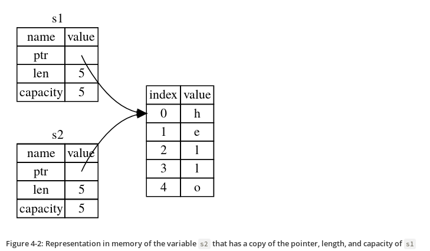
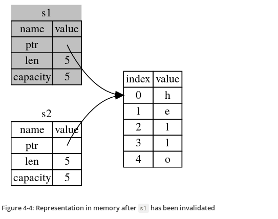

# Chapter 4 - Understanding Ownership

## Heap vs Stack

* When your code calls a function, the values passed into the function
(including, potentially, pointers to data on the heap) and the
function’s local variables get pushed onto the stack. When the
function is over, those values get popped off the stack.
* Accessing data in the heap is slower than accessing data on the
  stack because you have to follow a pointer to get there.

## Ownership rules

* Each value in Rust has a variable that’s called its owner.
* There can only be one owner at a time.
* When the owner goes out of scope, the value will be dropped.

## The String type

* This type is stored on heap.
* Can be mutated.

``` rust
{
    let s1 = String::from("hello"); // s1 is valid from this point forward

    // do stuff with s1
}                                  // this scope is now over, and s1 is no
                                   // longer valid
```

 When a variable goes out of scope, Rust calls a special function for
 us. This function is called `drop`, and it’s where the author of
 `String` can put the code to return the memory. Rust calls drop
 automatically at the closing curly bracket.

> Representation of s1 in memory


## Ways Variable and Data interact

``` rust
let x = 5;
let y = x;
```

* In the above code, we bind the value 5 to x; then make a *copy* of the
  value in x and bind it to y.
* This happens because integers are simple values with a known, fixed
  size, and these two 5 values are pushed onto the stack.

Now let's look at the `String` version:

``` rust
let s1 = String::from("hello");
let s2 = s1;
```

This looks very similar to the previous code, so we might assume that
the way it works would be the same: that is, the second line would
make a copy of the value in s1 and bind it to s2. But this isn’t quite
what happens.

> What happens after s2 = s1



> But s1 gets invalidated



## Ownership and functions

The semantics for passing a value to a function are similar to those
for assigning a value to a variable. Passing a variable to a function
will move or copy, just as assignment does.

``` rust
fn main() {
    let s = String::from("hello");  // s comes into scope

    takes_ownership(s);             // s's value moves into the function...
                                    // ... and so is no longer valid here

    let x = 5;                      // x comes into scope

    makes_copy(x);                  // x would move into the function,
                                    // but i32 is Copy, so it’s okay to still
                                    // use x afterward

} // Here, x goes out of scope, then s. But because s's value was moved, nothing
  // special happens.

fn takes_ownership(some_string: String) { // some_string comes into scope
    println!("{}", some_string);
} // Here, some_string goes out of scope and `drop` is called. The backing
  // memory is freed.

fn makes_copy(some_integer: i32) { // some_integer comes into scope
    println!("{}", some_integer);
} // Here, some_integer goes out of scope. Nothing special happens.
```

## References and Borrowing

Example code of References:

``` rust
fn main() {
    let s1 = String::from("hello");

    let len = calculate_length(&s1);

    println!("The length of '{}' is {}.", s1, len);
}

fn calculate_length(s: &String) -> usize {
    s.len()
}
```

These ampersands are references, and they allow you to refer to some
value without taking ownership of it.

We call having references as function parameters borrowing.

Just as variables are immutable by default, so are references. We’re
not allowed to modify something we have a immutable reference to.

## Mutuable references

Example code of mutable reference:

``` rust
fn main() {
    let mut s = String::from("hello");

    change(&mut s);
}

fn change(some_string: &mut String) {
    some_string.push_str(", world");
}
```

But mutable references have one big restriction: you can have only one
mutable reference to a particular piece of data in a particular
scope. This code will fail:

``` rust
let mut s = String::from("hello");

let r1 = &mut s;
let r2 = &mut s;
```

The benefit of having this restriction is that Rust can prevent data
races at compile time. A similar rule exists for combining mutable and
immutable references:

``` rust
let mut s = String::from("hello");

let r1 = &s; // no problem
let r2 = &s; // no problem
let r3 = &mut s; // BIG PROBLEM
```

## The Slice type

Another data type that does not have ownership (the other one is
references) is the slice.

### String Slices

``` rust
let s = String::from("hello world");

let hello = &s[0..5];
let world = &s[6..11];
```

We can create slices using a range within brackets by specifying
[starting_index..ending_index], where starting_index is the first
position in the slice and ending_index is one more than the last
position in the slice.

Other examples:

``` rust
let s = String::from("hello");

let slice = &s[0..2];
let slice = &s[..2];
```

``` rust
let s = String::from("hello");

let len = s.len();

let slice = &s[3..len];
let slice = &s[3..];
```

``` rust
let s = String::from("hello");

let len = s.len();

let slice = &s[0..len];
let slice = &s[..];
```

The type that signifies “string slice” is written as &str:


``` rust
fn first_word(s: &String) -> &str {
    let bytes = s.as_bytes();

    for (i, &item) in bytes.iter().enumerate() {
        if item == b' ' {
            return &s[0..i];
        }
    }

    &s[..]
}
```

### Other Slices

``` rust
let a = [1, 2, 3, 4, 5];

let slice = &a[1..3];
```

This slice has the type &[i32].

[Bonus: Explanation of String and it's variation from burntsushi](https://www.reddit.com/r/rust/comments/gnd4bd/things_i_hate_about_rust/fr9179w/?utm_source=reddit&utm_medium=web2x&context=3 "Bonus: Explanation of String and it's variation from burntsushi")
